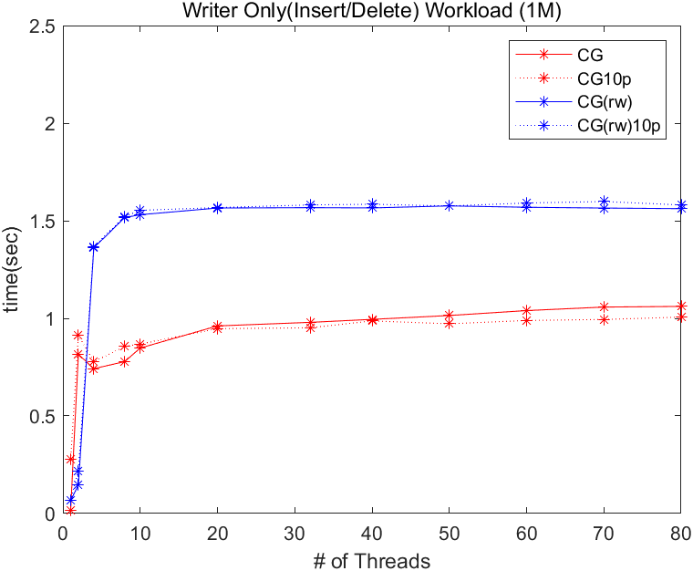

# Reader-Writer-BST
Simple Semaphore-based Concurrent BST with Reader-Writer, by Inho Song, Dankook UNIV.  
This project is a personal extend study of DKU Operating System lecture, Professor Jongmoo Choi.  

In a nutshell, mutex based semaphore rw-lock contension overhead much higher than a single mutex CG.  
For future study, fine-grain & low overhead rw-lock should be implemented 
TODO : Implement fine-grain & low overhead rw-lock  
